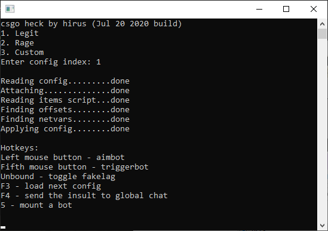

# heck external
Fully featured CS:GO external cheat.

# Disclaimer
The cheat is outdated, signatures and offsets need to be updated.

No ESP.

UserCmd features unbind left mouse button.

bSendPacket features don't work on a local server in Release build due to it using m_flNextCmdTime method.

# Features
## Aim:
* Aimbot:
  - Enable
  - VKey
  - Team check
  - Auto fire
  - Hitscan:
    - Enable
    - Priority (1 - most dmg, 2 - closest)
    - Head
    - Body
    - Shoulders
    - Legs
    - Toes
  - Pseudo auto wall
  
  - Rage:
    - Enable
    - Prioritize bone
    - FOV
    - Auto scope
    - Body aim with AWP
    - Silent aim
    - Hit chance:
      - Enable
      - Pistols %
      - SMGs %
      - Rifles %
      - Machineguns %
      - Shotguns %
      - Auto-snipers %
      - SSG08 %
      - AWP  %
      
  - Weapon category settings:
    - Prioritize bone
    - Scale FOV by distance
    - FOV
    - Speed
    - Ignore enemies in air
    - Disable when flashed
    - Silent aim

* RCS:
  - Enable
  - Always on
  - Vertical %
  - Horizontal %

* Triggerbot:
  - Enable
  - VKey
  - Disable when flashed

* Auto pistol
* Backtrack:
  - Enable
  - Max [1-12]

## Visuals:
* Team check
* Glow ESP:
  - Players
  - Style (0 - outside, 1 - silhouette, 2 - inside)
  - Patch flicker
  - Color
  - Color health based
    - Color 0 hp
    - Color 100 hp
  - Show vunerable 
  - Vunerable color
  - Dropped C4
  - Grenades

* Model tone:
  - Enable
  - Color

* Show enemies on radar
* Update delay (ms)

## Misc:
* Auto jump:
  - Enable
  - Legit looking

* Fake lag:
  - Enable
  - Toggle VKey (0 - no key)
  - Ticks lag
  - Ticks pass
  - Disable when shooting
  - Only in air
  
* Hitsound:
  - Enable
  - Style 
  - Volume %
  
* Nightmode:
  - Enable
  - Lightscale
  
* Skybox name
* Enable "name" command
* Auto accept
* Reveal ranks
* Disable post-processing
* No smoke
* No sniper scope
* Visual no recoil (1 - no punch, 2 - no recoil)
* Max flash %
* Viewmodel FOV
* View FOV
* Load next config vkey
* Insult vkey
* Bot mount vkey (aka runboost bot)

# Compile
You can compile with or without the "insult" feature. 

### Compiling with the "insult" feature
* Compile libcurl with windows SSPI or other SSL (but you'll have to set CA cert)
* Fix project's include paths
* Select "Release" project configuration
* Compile the cheat

### Compiling without "insult" feature
* Select "Release (no curl)" project configuration
* Compile the cheat

# Usage
* Copy contents of "configs" folder into cheat's directory
* Optionally edit configs to enable/disable features (0 - off, 1 - on)
* Optionally add different hitsounds by placing the WAV files in "hitsounds" folder and naming them "\*single digit\*.wav" ("1.wav" etc.)
* Start the cheat

Config parsing depends on the order of settings (e.g. 1st setting must be "aimbot enable"), you'll most likely get "Warning: MapVirtualKey returned 0" if you break the order.

# Credits
* nuggah for external UserCmd manipulation
* Forza for signature finder
* ReactiioN for hitbox enum
* keybode for BSP parser
